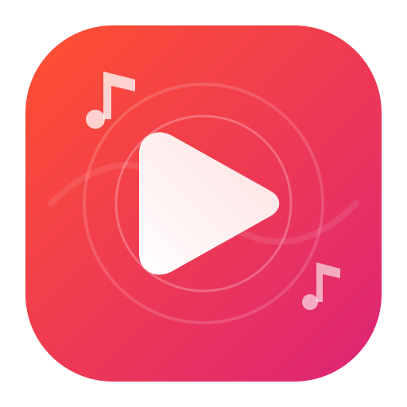
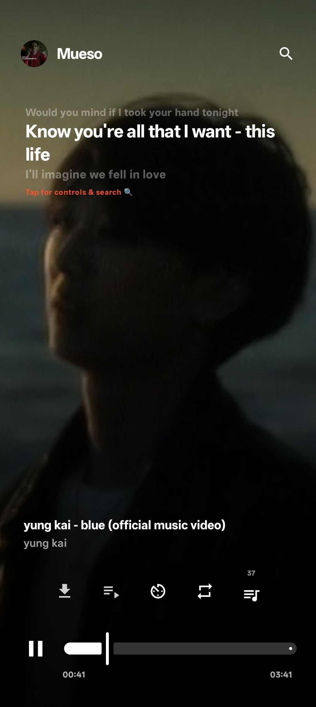
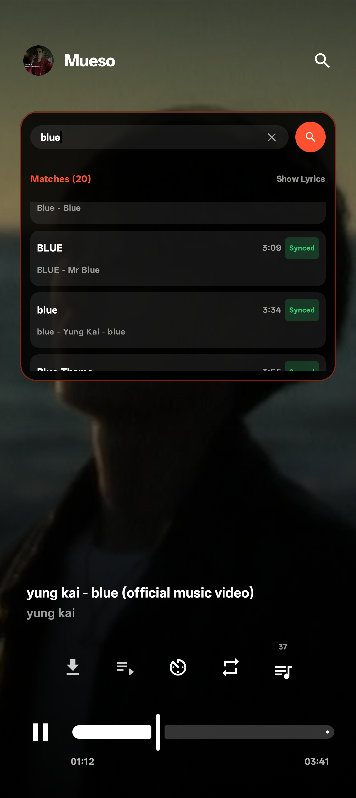
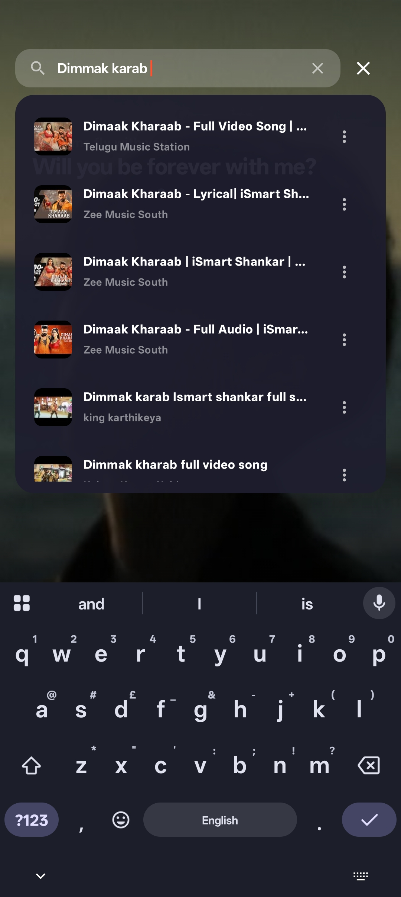
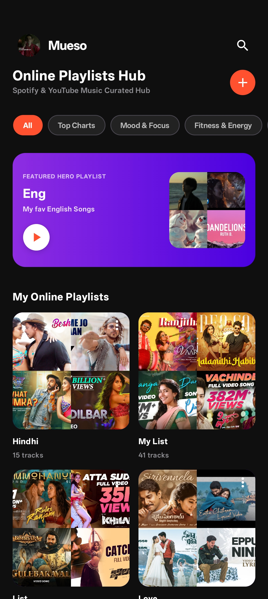
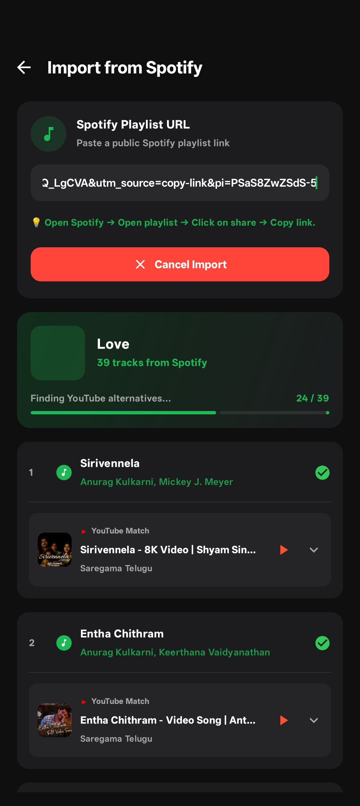
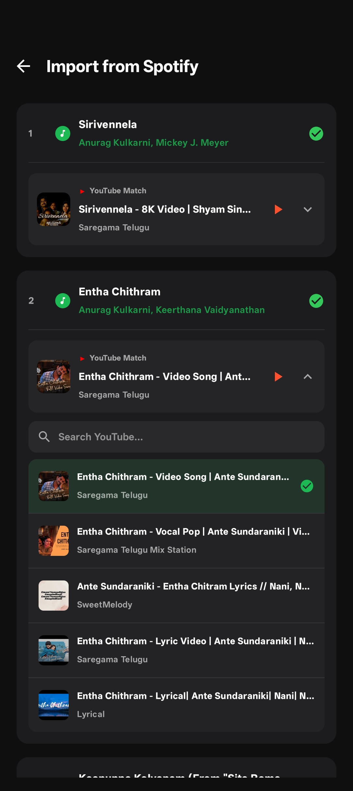
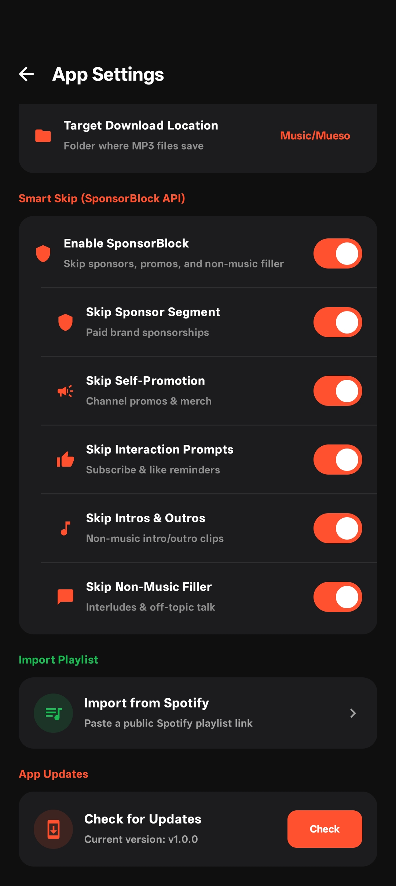
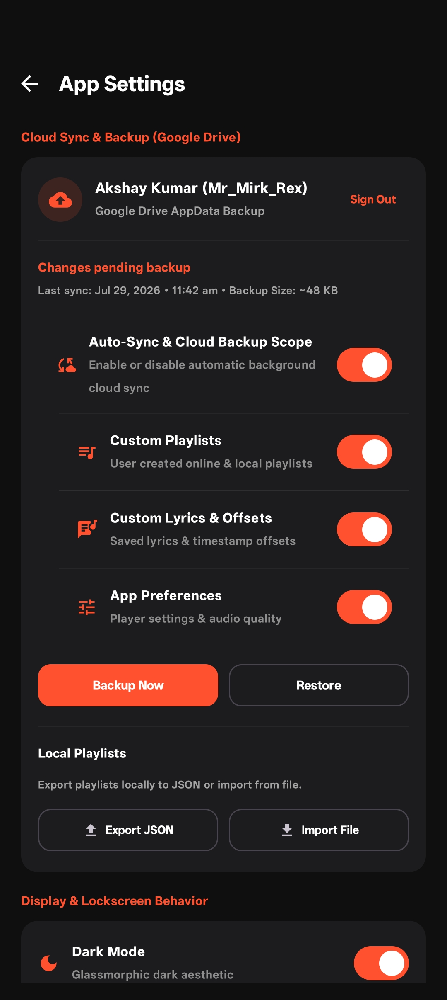

<div align="center">
  
  <h1>Mueso</h1>
  <p><strong>A Modern, Open-Source Android Music Player</strong></p>

  <p>
    
    
    
  </p>
  <p>
    
    
    
    
  </p>
</div>

<br />

**Mueso** is a next-generation, high-performance Android music player built with **Jetpack Compose**, **Material 3**, and **AndroidX Media3 ExoPlayer**. It seamlessly bridges local offline audio libraries with online streaming, native YouTube Music personalization, rich artist pages, mood & genre exploration, real-time LRCLIB synced lyrics, smart SponsorBlock segment filtering, native ID3/MP4 metadata tagging, and high-speed playlist downloads.

> [!TIP]
> **Creating or importing a playlist is recommended for the best experience!** Import your favorite Spotify playlists or sync your YouTube Music account to enjoy seamless queue management and reels-style vertical playback.

---

## 📱 Screenshots & Previews

<div align="center">
  <table>
    <tr valign="top">
      <td align="center" valign="top" width="25%">
        <br />
        <sub><b>Reels-Style Player</b></sub>
      </td>
      <td align="center" valign="top" width="25%">
        <br />
        <sub><b>Search & Pick Lyrics</b></sub>
      </td>
      <td align="center" valign="top" width="25%">
        <br />
        <sub><b>Online Multi-Category Search</b></sub>
      </td>
      <td align="center" valign="top" width="25%">
        <br />
        <sub><b>Curated Playlists & Moods</b></sub>
      </td>
    </tr>
    <tr valign="top">
      <td align="center" valign="top" width="25%">
        <br />
        <sub><b>Spotify Playlist Import</b></sub>
      </td>
      <td align="center" valign="top" width="25%">
        <br />
        <sub><b>Stream Matching Review</b></sub>
      </td>
      <td align="center" valign="top" width="25%">
        <br />
        <sub><b>SponsorBlock Settings</b></sub>
      </td>
      <td align="center" valign="top" width="25%">
        <br />
        <sub><b>App Settings & Account Sync</b></sub>
      </td>
    </tr>
  </table>
</div>

---

## ✨ Features

- **📱 Reels-Style Vertical Swipe Player**: Modern fullscreen Vertical Pager layout for smooth swipe-up/down gestures to transition between tracks like reels, complete with dynamic background artwork blur, animated playback controls, and quick lyrics view.
- **🖼️ Interactive Player Background Framing**: Long-press and drag sideways on the fullscreen player background to custom-frame and position album art. Customized positions are persisted and synced per playlist track.
- **⚡ Native InnerTube Engine & YouTube Music Personalization**: Zero-overhead native Kotlin InnerTube client for ultra-fast streaming and account synchronization. Connect your YouTube Music account to stream your personalized library, custom playlists, and recommendations without third-party dependencies.
- **🎤 Dedicated Artist Detail Pages**: Full-featured artist exploration screen featuring artist banner, subscriber count, bio, and organized sections for **Top Songs**, **Albums**, **Singles & EPs**, **Music Videos**, **Live Performances**, **Featured On**, and **Similar Artists**, plus instant **Radio** and **Shuffle** launch buttons.
- **🔍 Multi-Category Search & LRU Caching**: Fast search across **All**, **Songs**, **Videos**, **Albums**, **Playlists**, and **Artists** with in-memory caching for instant tab switches without redundant network calls.
- **🎭 Moods, Genres & Curated Shelves**: Explore dynamic categories (Chill, Focus, Workout, Party, Romance, Charts, and more) with customized row shelves and direct playlist playback.
- **🎬 Song | Video Mode**: Clean toggle between synced audio/lyrics mode and video playback for music videos. Smart availability detection automatically hides the toggle when video content is not available.
- **🎵 Synced Lyrics & Interactive Candidate Picker**: Automatic real-time synced lyrics via LRCLIB with line-by-line karaoke highlights, manual timing offset adjusters (+/- 500ms), and an interactive search dialog to match alternate lyrics.
- **🟢 Spotify-to-YouTube Playlist Import**: Paste any public Spotify playlist URL to instantly fetch track listings and match them against high-quality online audio streams with interactive top-down review and alternative selection.
- **🛡️ Smart SponsorBlock Audio Filtering**: Master toggle with customizable sub-settings to automatically skip non-music segments, sponsor messages, self-promotions, and intros/outros in real-time during online streaming.
- **📥 Offline Library & Quality-Aware Downloads**: Download audio tracks directly in High / Medium / Low quality with natively embedded ID3v2.3 (MP3) and MP4 Box (M4A) metadata tags, high-res cover art, and companion `.lrc` lyrics files.
- **🔄 In-App Updates & Self-Installer**: Automatically check GitHub Releases for app updates, view changelogs, track download progress, and install new APKs directly within the app.
- **🔒 Lockscreen Controls & Sleep Timer**: Full playback controls on Android lockscreen and status bar media notification with configurable sleep timers (timer duration, after song, or end of playlist).
- **☁️ Automated Google Drive Backup**: Backup and restore your custom playlists, track background adjustments, hero banners, and app preferences securely to Google Drive AppData.

---

## 📦 Download & Release Builds

We publish automated signed builds via GitHub Actions with architecture-specific APK splits for optimal download sizes:

| Package | Target Architecture | Recommended For | Approximate Size |
| :--- | :--- | :--- | :--- |
| **`app-arm64-v8a-release.apk`** | 64-bit ARM | **Recommended for 95%+ of modern Android phones** | **~6.0 MB** |
| **`app-armeabi-v7a-release.apk`** | 32-bit ARM | Older 32-bit Android phones | **~6.0 MB** |
| **`app-x86_64-release.apk`** | 64-bit x86 | Android Emulators, ChromeOS, PC | **~6.0 MB** |
| **`app-universal-release.apk`** | All ABIs | Universal fallback (contains all architectures) | **~6.1 MB** |

---

## 🛠️ Architecture & Tech Stack

Mueso follows modern **MVVM Clean Architecture** guidelines:

| Component | Technology |
| :--- | :--- |
| **UI Framework** | Jetpack Compose (1.6+), Material 3 Design System |
| **Audio Engine** | AndroidX Media3 ExoPlayer |
| **Online Client** | Native Kotlin InnerTube Client (YouTube Music API) |
| **State Management** | Kotlin Coroutines, StateFlow, ViewModel |
| **Database** | Room Persistence Library |
| **Networking & HTTP** | OkHttp 3, Moshi JSON |
| **Metadata Tagging** | Native Kotlin ID3v2.3 & MP4 Box Audio Tagger |
| **Lyrics API** | LRCLIB Synced Lyrics API |
| **Cloud Backup** | Google Drive REST API & WorkManager Auto-Sync |
| **Sponsor Filtering** | SponsorBlock Community API |
| **App Updates** | GitHub Releases API & Android FileProvider Installer |
| **Image Loading** | Coil Compose |

---

## 🚀 Building & Setup

### Prerequisites
- **Android Studio**: Ladybug / Koala / Jellyfish (2024.1+)
- **JDK**: Version 17+
- **Min SDK**: 24 (Android 7.0)
- **Target SDK**: 36 (Android 15)

### Clone & Compile

```bash
# Clone the repository
git clone https://github.com/Akshay-86/Mueso.git
cd Mueso

# Build Debug APK
./gradlew assembleDebug
```

---

## 🙏 Open Source Credits

Mueso is built on top of amazing open-source technologies, tools, and community APIs:

- [AndroidX Media3 ExoPlayer](https://developer.android.com/media/media3)
- [Jetpack Compose](https://developer.android.com/jetpack/compose)
- [SponsorBlock API](https://sponsor.ajay.app/)
- [android-youtube-player](https://github.com/PierfrancescoSoffritti/android-youtube-player)
- [LRCLIB](https://lrclib.net/)

---

## 🤝 Contributing, Issues & Feedback

Contributors are very welcome! Feel free to **fork** this repository, make changes, and submit a **Pull Request**.

If any credits were missed, or if you have any issues, complaints, or feedback, feel free to:
- Open a GitHub [Issue](https://github.com/Akshay-86/Mueso/issues) or submit a [Pull Request](https://github.com/Akshay-86/Mueso/pulls).
- Or email directly at **[nalliakshaykumar@gmail.com](mailto:nalliakshaykumar@gmail.com)**.

---

## 📄 License

Distributed under the **MIT License**. See [`LICENSE`](LICENSE) for more information.
